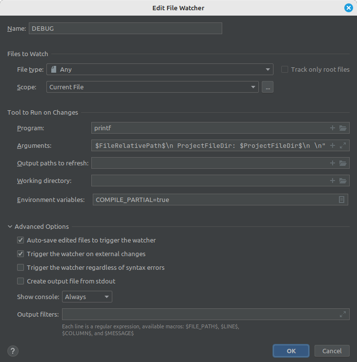

# {{ $frontmatter.title }}

## {{ $frontmatter.subtitle }}

### Program:

```shell
printf
```

### Arguments:

```
"\n
FileDir: $FileDir$\n
FileDirName: $FileDirName$\n
FileDirPathFromParent: $FileDirPathFromParent$\n
FileDirRelativeToProjectRoot: $FileDirRelativeToProjectRoot$\n
FileDirRelativeToSourcepath: $FileDirRelativeToSourcepath$\n
FileExt: $FileExt$\n
FileName: $FileName$\n
FileNameWithoutAllExtensions: $FileNameWithoutAllExtensions$\n
FileNameWithoutExtension: $FileNameWithoutExtension$\n
FileParentDir: $FileParentDir$\n
FilePath: $FilePath$\n
FilePathRelativeToProjectRoot: $FilePathRelativeToProjectRoot$\n
FilePathRelativeToSourcepath: $FilePathRelativeToSourcepath$\n
FileRelativeDir: $FileRelativeDir$\n
FileRelativePath: $FileRelativePath$\n
ProjectFileDir: $ProjectFileDir$\n
\n"
```

### Example output

```
FileDir: /home/user/PhpstormProjects/Example/assets/styles/partials
FileDirName: partials
FileDirPathFromParent: 
FileDirRelativeToProjectRoot: assets/styles/partials
FileDirRelativeToSourcepath: 
FileExt: scss
FileName: _vars.scss
FileNameWithoutAllExtensions: _vars
FileNameWithoutExtension: _vars
FileParentDir: /home/user/PhpstormProjects/Example/assets/styles
FilePath: /home/user/PhpstormProjects/Example/assets/styles/partials/_vars.scss
FilePathRelativeToProjectRoot: assets/styles/partials/_vars.scss
FilePathRelativeToSourcepath: 
FileRelativeDir: assets/styles/partials
FileRelativePath: assets/styles/partials/_vars.scss
ProjectFileDir: /home/user/PhpstormProjects/Example
```


### Screenshot




<br/>

::: details
Environment variable `COMPILE_PARTIAL=true` is required to trigger `File Watcher` on SCSS partial files.
:::


<style module>
img {max-width: 500px; width: 100%;}
</style>
